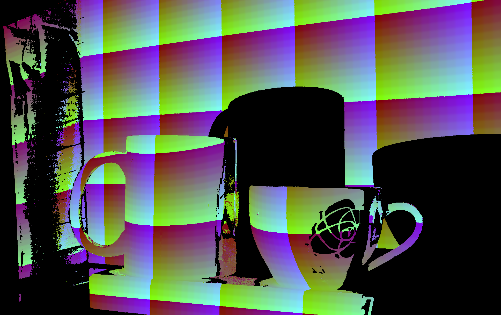

# phase-shifting
This repository provides an implementation of robust 3-step phase-shifting method combined with graycode patterns.


## What is phase-shifting method?

The phase-shifting method, also called fringe patterns or sinusoidal patterns, is a kind of structured light pattern used for display-camera systems.
These methods provide algorithms to measure the correspondences from the camera pixels to the display pixels.

Phase-shifting method computes these correspondences by unwrapping phase map from some images which capture displayed sinusoidal patterns.

The main advantage of phase-shifting method is that theoretically can estimate the corresponding display pixels at subpixel accuracy.

## Implementation in this repository

Although there are some derivative methods, I implemented the 3-step phase-shifting method which is the simplest one.
Also, to obtain the global position of each cycles, I combined graycode patterns and two sets of sinusoidal patterns whose frequencies are different.
The periods of these patterns are defined as follows with user-defined parameter `step` \[pix\].

||period \[pix\]|
|----|----|
|Sinusoidal-1 (S1)|`step/3`|
|Sinusoidal-2 (S2)|`step/2`|
|Graycode (GC)|`step/2`|

For each camera pixels, the coordinate of corresponding display pixel are estimated by following process.

1. Unwrap the phases from S1 and S2.
    * `arctan2(sqrt(3)*(img1 - img3), 2*img2 - img1 - img3)`
2. Compute the phase difference (it is not a simple subtraction between unwrapped values).
3. Decode and interpolate the graycode coordinate on the GC map.
    * Interpolation is required for pixels on the border of graycode patterns.
    * Mask is computed by dilating and eroding (kernel size : `2*filter_size+1`).
    * The average of decoded coordinates of neighbouring pixels is set (kernel size : `2*filter_size+1`).
4. Compute the coordinate of the corresponding display pixel.
    * Phase is the value unwrapped from S1.
    * Global position is computed using the phase, phase difference and graycode coordinate complementarily.

## How to use

### 1. Calibrate gamma value

Before generate patterns, you should calibrate gamma values of your display-camera system.

The phase-shifting method requires that the input value to the display and the output value from the camera are linear.
However, most of imaging and display devices transform their input values based on their gamma value (in general, display : 2.2, camera : 1/2.2).
Thus, if your devices are gamma adjustable, set their gamma value to 1.0.
Otherwise, you should calibrate the gamma value using `gamma_correction.py` and correct sinusoidal patterns in advance.

The implementation of `gamma_correction.py` is based on following paper.

```
HOANG, Thang, et al. Generic gamma correction for accuracy enhancement in fringe-projection profilometry. Optics letters, 2010, 35.12: 1992-1994.
```

First, generate graycode patterns and sinusoidal patterns with two arbitrary encoding value (`gamma_p1` and `gamma_p2`).

```sh
python gamma_correction.py gen <display_width> <display_height> <gamma_p1> <gamma_p2> <output_dir> [-step <graycode_step(default:1)>

# example
python gamma_correction.py gen 1920 1080 0.75 1.25 ./gamma_correction_patterns
```

Generated patterns and `config.xml` will be saved in the output directory.

Then, display or project patterns on a planar surface and capture them from the camera.

Finaly, run following command.

```sh
python gamma_correction.py dec <prefix of captured patterns> <path to config.xml> [-black_thr <black threashold>] [-white_thr <white threashold>]

# example (you can test this command in `sample_data/gamma_correction`)
python gamma_correction.py dec ./pat ./config.xml -black_thr 30 -white_thr 4
```

`black_threashold` is a threashold to determine whether a camera pixel captures projected area or not.
`white_threashold` is a threashold to specify robustness of graycode decoding.
To avoid decoding error in graycode, increase these numbers.

Estimated `gamma_p` will be displayed on your terminal.
By preapplying the estimated `gamma_p` to sinusoidal patterns, you will be able to capture linealized images.

### 2. Generate patterns

You can generate pattern images by following command.
If you calibrated the `gamma_p` of your system, give it via `-gamma <gamma_p>` option.

```sh
python ./phase_shifting.py gen <display_width> <display_height> <step> <output_dir> [-gamma <gamma_p>]

# example
python phase_shifting.py gen 1920 1080 400 ./patterns -gamma 1.654
```

This command saves pattern images (`pat00.png` ~ `patXX.png`) and a config file (`config.xml`) into the output directory.

I recommend you to make the `step` as smaller as possible in the range that you will not find moire in captured graycode patterns.

### 3. Capture displayed patterns

Display generated patterns on your display and capture it by your camera one by one.
Captured images must be saved as `xxxx00.png` ~ `xxxxXX.png` in a single directory.

### 4. Decode patterns

You can decode captured images by following command.

```sh
python ./phase_shifting.py dec <input_prefix> <config_path> <output_path> [-black_thr <black threashold>] [-white_thr <white threashold>] [-filter_size <for interpolation of graycode(default:0)>]

# example (you can test this command in `sample_data/object1` and `sample_data/object2`)
python3 phase_shifting.py dec ./pat ./config.xml ./ -black_thr 20 -white_thr 4 -filter_size 1
```

This command saves following 2 files in the specified directory.

1. Visualized image (`visualized.png`)
    * B : decoded x coordinate of display pixel
    * G : decoded y coordinate of display pixel
    * R : 128 if decoded successfully
    * The coordinate values are folded back at every 256 pixels
2. List of decoded coordinates (`camera2display.csv`)
    * `camera_y, camera_x, display_y, display_x`

Note : Striped pattern appeares in this figure because I set inproper `gamma_p1` and `gamma_p2` in gamma calibration step and got bad `gamma_p`. I'm goint to update sample data when I have time.


